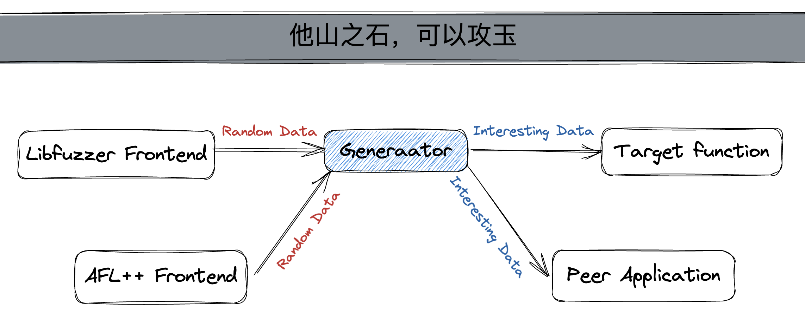

# AFL++ Plugin: Data-Generator Extractor
This plugin allows AFL++ to use LibFuzzer's data generators for fuzzing. The plugin extracts generators from LibFuzzer and integrates them into AFL++.
## Motivation


The primary motivation behind this plugin is to enhance the fuzzing capabilities of AFL++ by utilizing the powerful data generators present in specific LibFuzzers. These data generators can construct complex inputs that meet certain structures, syntax, or semantics, making AFL++ more effective when testing PEER applications. This idea is inspired by a saying from the Chinese classic "Book of Songs" (诗经): "The stones from other hills can be used to polish jade" (他山之石, 可以攻玉), emphasizing the value of learning from others to improve oneself.

## Example Building

1. Build the AFL++ compiler.
This will create the patched `afl-cc`.

2. Build the plugin:
```
cd utils/aflpp_extractor
AFL_EXTRACT=1 make
```

This will compile and create the files:
- `libAFLExtractor.a`: The static library containing the AFL++ Extractor plugin.
- `extractor_test_fuzzer`: The library that demonstrates how to extract generator using this plugin.
- `reproducer`: The program that reads an input file, processes it with the extracted generator, and writes the result to an output file.

The `AFL_EXTRACT` environment variable makes `afl-cc` treat `-fsanitize=fuzzer*` as linking `libAFLExtractor.a`, and compiles the target as a shared library (maybe executable bin file originally) automatically.

## For Your Use
Assume you have a generation-based libfuzzer `fuzzer_harness.c`:
```
size_t generate_magic_data(const uint8_t *data, size_t size){

    /* 1. Consume the random data */
    /* 2. Construct random data into more complex data to   */
    /*    satisfy a certain structure, syntax or semantics  */
}

/* libFuzzer's required entry point. */
int LLVMFuzzerTestOneInput(const uint8_t *data, size_t size) {
  /* Generate magic data */
  uint8_t * magic_data = generate_magic_data(data, size);

  /* Call function to be fuzzed using the magic_data */
  target_function(modified_data);

  /* Reset state. e.g. free something */
}
```
And this is the clang compile command to build for libfuzzer: 
```
clang -o fuzz -fsanitize=fuzzer fuzzer_harness.cc
```
OK, if you find the data generator to be quite ingenious and you want to use it in AFL++, set it up as follows:

#### 1) Include the header before `LLVMFuzzerTestOneInput`:
```
#include "fuzzer_ext.h"
```
or just add this:
```
typedef struct mutate_helper {
    uint8_t *buf;
    size_t len;
} mutate_helper_t;

#ifdef __cplusplus
extern "C" {
#endif
    void mutate_helper_buffer_copy(unsigned char *buf, size_t buf_size);
#ifdef __cplusplus
}
#endif 
```

#### 2) Call `mutate_helper_buffer_copy` after the `generate_magic_data`:
```
mutate_helper_buffer_copy(modified_data, modified_data_length);
```

#### 3) Remove the `target_function` call.
```
# target_function(modified_data);
```

#### 4) Recompile this libfuzzer, replacing clang with `afl-clang-fast`, with `AFL_PATH` needed.
```
export AFL_EXTRACT=1
export AFL_PATH={your_afl_install_path}
afl-clang-fast -o fuzz -fsanitize=fuzzer fuzzer_harness.cc
```
The `afl-clang-fast` will automatically produce a shared library with the same name, which can be used in custom mutator of `afl-fuzz` later on.

